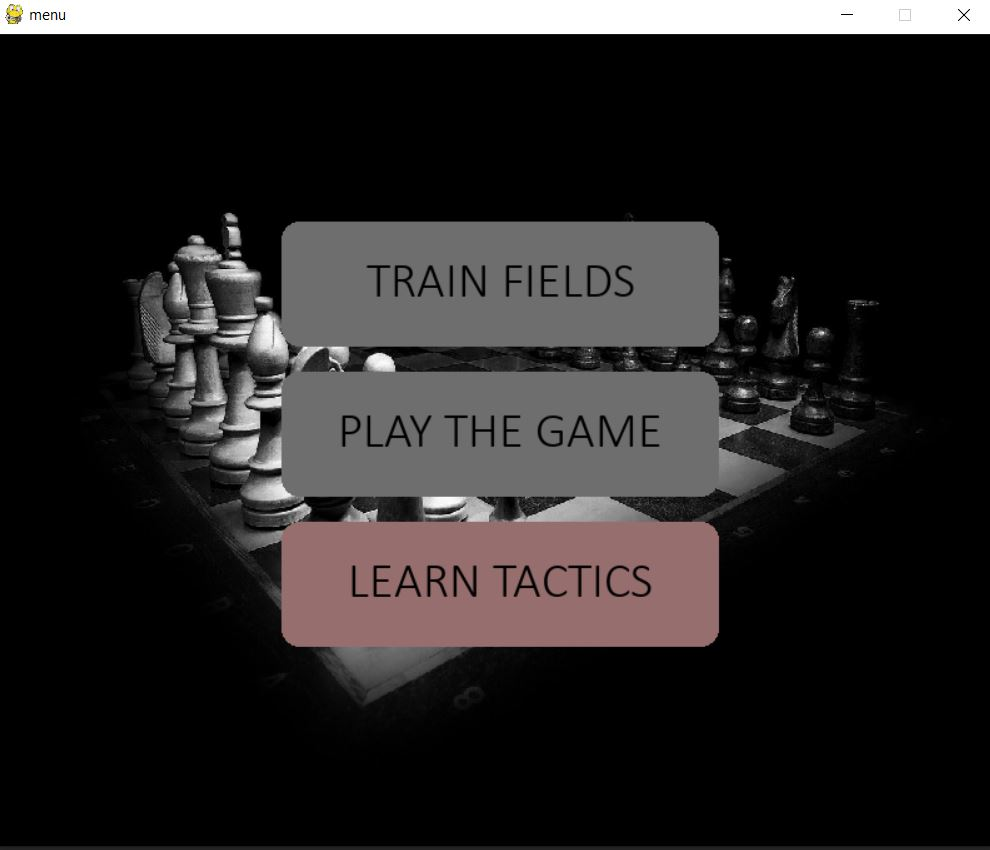
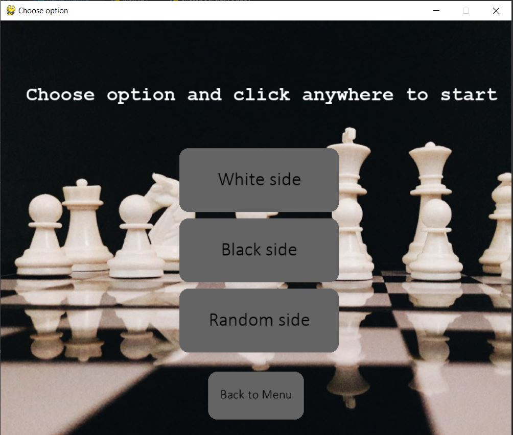
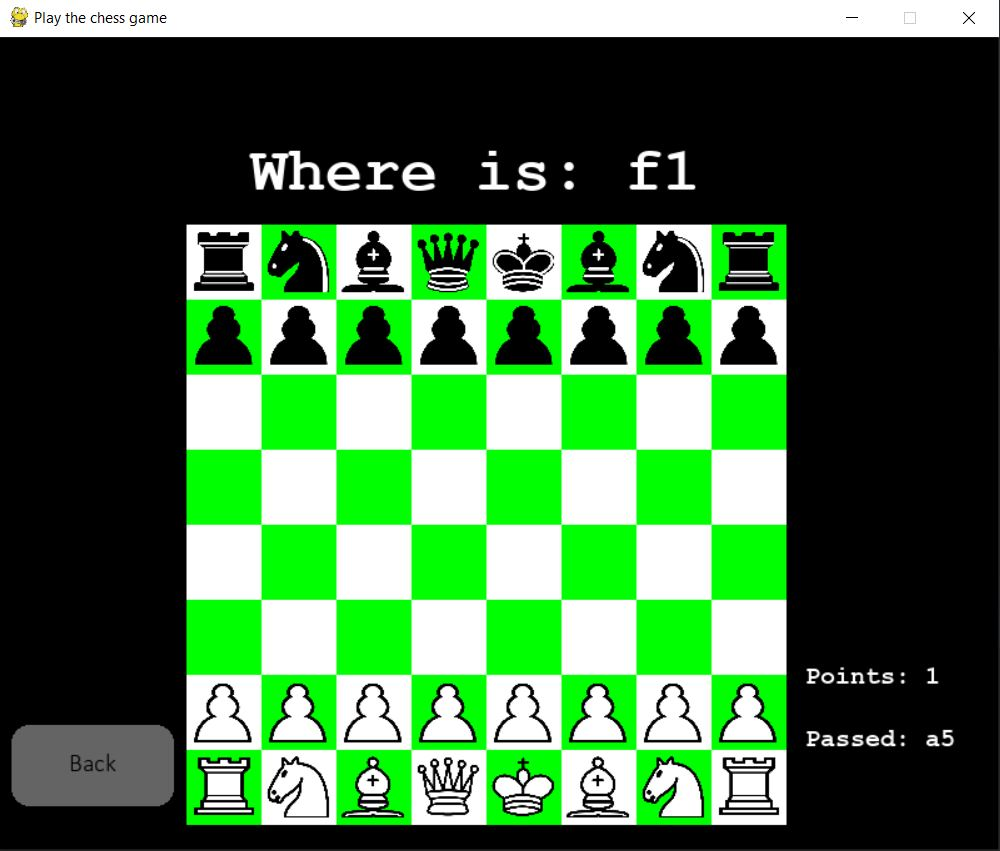

# Chess game in Python

## Short description:
The main goal is to allow user to learn chessboard fields. It is very important
for newbie chess heroes. This ability allow them to consider transcripts
of the gameplays of the biggest masters.

## Used technologies:
- pygame module
- simple AI (computer player)

## Modules of the game:
##### 1. Training module:
for beginner whos would like to start their adventure with
 chess like a real PRO - 
from basics :) 
- training position of the chessboard
- tactics

##### 2. Playing mode:
- player vs player
- player vs computer

##### 3. Module for learning tactics (in the future):
- engine implementation based on neural networks
- possibility to learn some tactical openings

## Application views:

